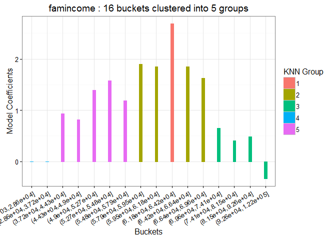
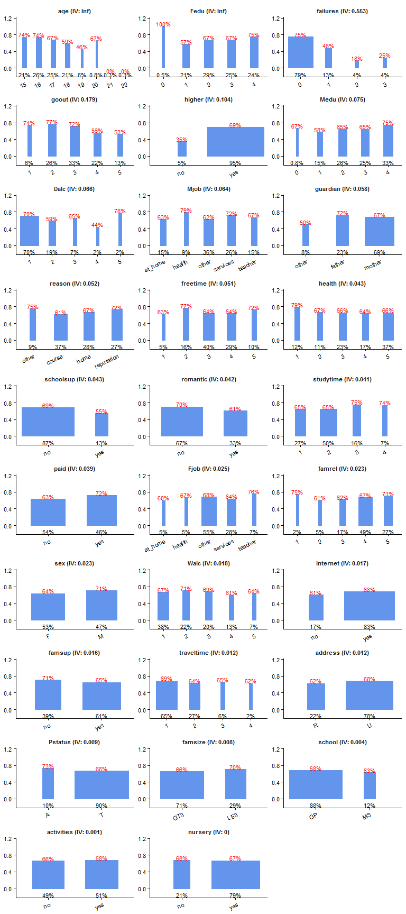
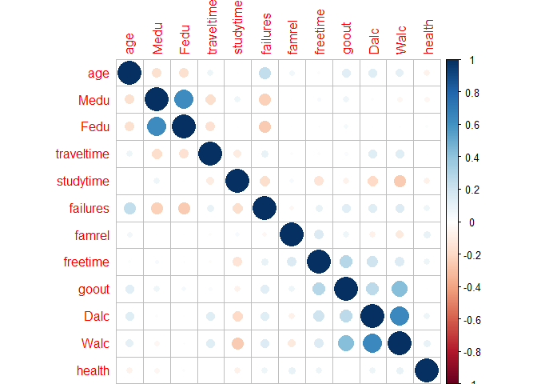
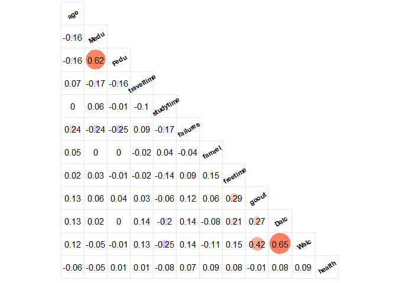
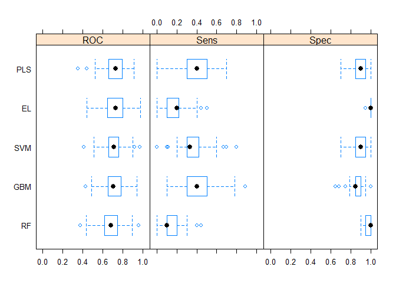
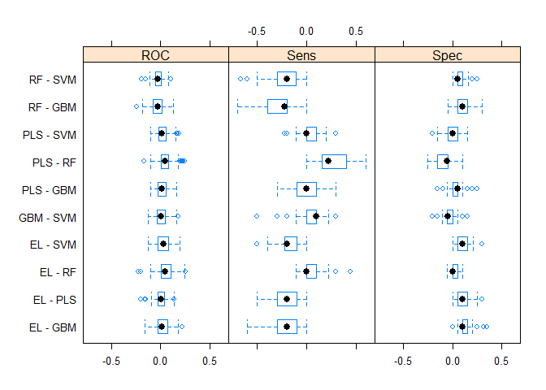
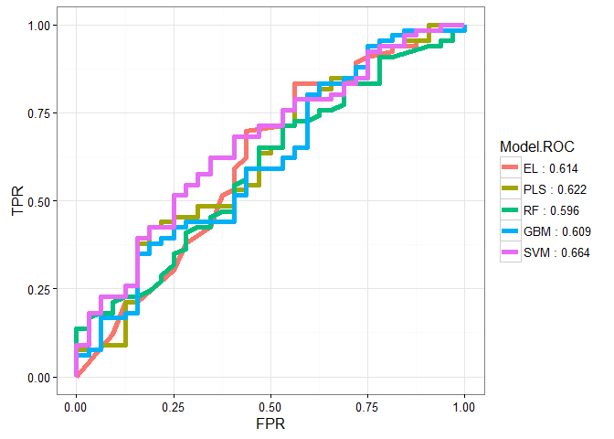

-   [Student Performance Prediction and Key Factors
    Identification](#student-performance-prediction-and-key-factors-identification)
    -   [Introduction](#introduction)
    -   [Data Preparation](#data-preparation)
    -   [Exploratory Data Analysis](#exploratory-data-analysis)
    -   [Modeling: Preparation](#modeling-preparation)
    -   [Modeling: Key Factors
        Identification](#modeling-key-factors-identification)
    -   [Modeling: Prediction](#modeling-prediction)
    -   [Model Performance](#model-performance)
    -   [Conclusion](#conclusion)
    -   [Reference](#reference)

Student Performance Prediction and Key Factors Identification
=============================================================

This document shows a complete workflow of predicting student
performance based on a publicly available
[dataset](https://archive.ics.uci.edu/ml/datasets/Student+Performance),
using different machine learning methods. The
[Presentation\_Huang.rmd](Presentation_Huang.rmd) file can be run as a
presentation with interactive visualization.

Introduction
------------

<ul class="incremental">
**Data Source**

Secondary school student attributes and performance: publicaly available
<https://archive.ics.uci.edu/ml/datasets/Student+Performance>

    ##      variable                                                 note
    ## 1      school                                    student's school 
    ## 2         sex                                       student's sex 
    ## 3         age                                        student's age
    ## 4     address                         student's home address type 
    ## 5     famsize                                         family size 
    ## 6     Pstatus                        parent's cohabitation status 
    ## 7        Medu                    mother's education (ordinal: 0-4)
    ## 8        Fedu                    father's education (ordinal: 0-4)
    ## 9        Mjob                                        mother's job 
    ## 10       Fjob                                        father's job 
    ## 11     reason                        reason to choose this school 
    ## 12   guardian                                  student's guardian 
    ## 13 traveltime            home to school travel time (ordinal: 0-4)
    ## 14  studytime                     weekly study time (ordinal: 0-4)
    ## 15   failures                       number of past class failures 
    ## 16  schoolsup                           extra educational support 
    ## 17     famsup                          family educational support 
    ## 18       paid         extra paid classes within the course subject
    ## 19 activities                          extra-curricular activities
    ## 20    nursery                              attended nursery school
    ## 21     higher                       wants to take higher education
    ## 22   internet                              Internet access at home
    ## 23   romantic                         with a romantic relationship
    ## 24     famrel       quality of family relationships (ordinal: 1-5)
    ## 25   freetime                free time after school (ordinal: 1-5)
    ## 26      goout                going out with friends (ordinal: 1-5)
    ## 27       Dalc           workday alcohol consumption (ordinal: 1-5)
    ## 28       Walc           weekend alcohol consumption (ordinal: 1-5)
    ## 29     health                 current health status (ordinal: 1-5)
    ## 30      grade  0/1 representing fail/pass in the mathematics class
    ## 31  famincome a virtual column used to explain the binning process

**Research Questions**

1.  Is it possible to predict student performance before a class begins?
2.  What are the important factors driving the performance differences
    among students?

</ul>
Data Preparation
----------------

<ul class="incremental">
**Load R Packages**

    # Load pacakges
    sapply(c('caret', 'e1071', 'knitr', 'reshape2', 'rpart', 'scales', 'gridExtra', 
      'glmnet', 'doSNOW', 'dplyr', 'ggplot2', 'streamlineR'), 
      require, character.only = TRUE, quietly = TRUE)

**Load Data**

    dt.org <- read.csv('data/student.grade.csv')
    dt <- select(dt.org, -famincome)
    dt$grade <- as.factor(dt$grade)

    head(dt, 3)  # top 3 rows

    ##   school sex age address famsize Pstatus Medu Fedu    Mjob    Fjob reason
    ## 1     GP   F  18       U     GT3       A    4    4 at_home teacher course
    ## 2     GP   F  17       U     GT3       T    1    1 at_home   other course
    ## 3     GP   F  15       U     LE3       T    1    1 at_home   other  other
    ##   guardian traveltime studytime failures schoolsup famsup paid activities
    ## 1   mother          2         2        0       yes     no   no         no
    ## 2   father          1         2        0        no    yes   no         no
    ## 3   mother          1         2        3       yes     no  yes         no
    ##   nursery higher internet romantic famrel freetime goout Dalc Walc health
    ## 1     yes    yes       no       no      4        3     4    1    1      3
    ## 2      no    yes      yes       no      5        3     3    1    1      3
    ## 3     yes    yes      yes       no      4        3     2    2    3      3
    ##   grade
    ## 1     0
    ## 2     0
    ## 3     1

    str(dt)  # data structure

    ## 'data.frame':    395 obs. of  30 variables:
    ##  $ school    : Factor w/ 2 levels "GP","MS": 1 1 1 1 1 1 1 1 1 1 ...
    ##  $ sex       : Factor w/ 2 levels "F","M": 1 1 1 1 1 2 2 1 2 2 ...
    ##  $ age       : int  18 17 15 15 16 16 16 17 15 15 ...
    ##  $ address   : Factor w/ 2 levels "R","U": 2 2 2 2 2 2 2 2 2 2 ...
    ##  $ famsize   : Factor w/ 2 levels "GT3","LE3": 1 1 2 1 1 2 2 1 2 1 ...
    ##  $ Pstatus   : Factor w/ 2 levels "A","T": 1 2 2 2 2 2 2 1 1 2 ...
    ##  $ Medu      : int  4 1 1 4 3 4 2 4 3 3 ...
    ##  $ Fedu      : int  4 1 1 2 3 3 2 4 2 4 ...
    ##  $ Mjob      : Factor w/ 5 levels "at_home","health",..: 1 1 1 2 3 4 3 3 4 3 ...
    ##  $ Fjob      : Factor w/ 5 levels "at_home","health",..: 5 3 3 4 3 3 3 5 3 3 ...
    ##  $ reason    : Factor w/ 4 levels "course","home",..: 1 1 3 2 2 4 2 2 2 2 ...
    ##  $ guardian  : Factor w/ 3 levels "father","mother",..: 2 1 2 2 1 2 2 2 2 2 ...
    ##  $ traveltime: int  2 1 1 1 1 1 1 2 1 1 ...
    ##  $ studytime : int  2 2 2 3 2 2 2 2 2 2 ...
    ##  $ failures  : int  0 0 3 0 0 0 0 0 0 0 ...
    ##  $ schoolsup : Factor w/ 2 levels "no","yes": 2 1 2 1 1 1 1 2 1 1 ...
    ##  $ famsup    : Factor w/ 2 levels "no","yes": 1 2 1 2 2 2 1 2 2 2 ...
    ##  $ paid      : Factor w/ 2 levels "no","yes": 1 1 2 2 2 2 1 1 2 2 ...
    ##  $ activities: Factor w/ 2 levels "no","yes": 1 1 1 2 1 2 1 1 1 2 ...
    ##  $ nursery   : Factor w/ 2 levels "no","yes": 2 1 2 2 2 2 2 2 2 2 ...
    ##  $ higher    : Factor w/ 2 levels "no","yes": 2 2 2 2 2 2 2 2 2 2 ...
    ##  $ internet  : Factor w/ 2 levels "no","yes": 1 2 2 2 1 2 2 1 2 2 ...
    ##  $ romantic  : Factor w/ 2 levels "no","yes": 1 1 1 2 1 1 1 1 1 1 ...
    ##  $ famrel    : int  4 5 4 3 4 5 4 4 4 5 ...
    ##  $ freetime  : int  3 3 3 2 3 4 4 1 2 5 ...
    ##  $ goout     : int  4 3 2 2 2 2 4 4 2 1 ...
    ##  $ Dalc      : int  1 1 2 1 1 1 1 1 1 1 ...
    ##  $ Walc      : int  1 1 3 1 2 2 1 1 1 1 ...
    ##  $ health    : int  3 3 3 5 5 5 3 1 1 5 ...
    ##  $ grade     : Factor w/ 2 levels "0","1": 1 1 2 2 2 2 2 1 2 2 ...

**Exclude Variables Without Variation**

    nzv(dt, saveMetrics = TRUE)  ## near zero variation

    ##            freqRatio percentUnique zeroVar   nzv
    ## school      7.586957     0.5063291   FALSE FALSE
    ## sex         1.112299     0.5063291   FALSE FALSE
    ## age         1.061224     2.0253165   FALSE FALSE
    ## address     3.488636     0.5063291   FALSE FALSE
    ## famsize     2.464912     0.5063291   FALSE FALSE
    ## Pstatus     8.634146     0.5063291   FALSE FALSE
    ## Medu        1.271845     1.2658228   FALSE FALSE
    ## Fedu        1.150000     1.2658228   FALSE FALSE
    ## Mjob        1.368932     1.2658228   FALSE FALSE
    ## Fjob        1.954955     1.2658228   FALSE FALSE
    ## reason      1.330275     1.0126582   FALSE FALSE
    ## guardian    3.033333     0.7594937   FALSE FALSE
    ## traveltime  2.401869     1.0126582   FALSE FALSE
    ## studytime   1.885714     1.0126582   FALSE FALSE
    ## failures    6.240000     1.0126582   FALSE FALSE
    ## schoolsup   6.745098     0.5063291   FALSE FALSE
    ## famsup      1.581699     0.5063291   FALSE FALSE
    ## paid        1.182320     0.5063291   FALSE FALSE
    ## activities  1.036082     0.5063291   FALSE FALSE
    ## nursery     3.876543     0.5063291   FALSE FALSE
    ## higher     18.750000     0.5063291   FALSE FALSE
    ## internet    4.984848     0.5063291   FALSE FALSE
    ## romantic    1.992424     0.5063291   FALSE FALSE
    ## famrel      1.839623     1.2658228   FALSE FALSE
    ## freetime    1.365217     1.2658228   FALSE FALSE
    ## goout       1.262136     1.2658228   FALSE FALSE
    ## Dalc        3.680000     1.2658228   FALSE FALSE
    ## Walc        1.776471     1.2658228   FALSE FALSE
    ## health      1.604396     1.2658228   FALSE FALSE
    ## grade       2.038462     0.5063291   FALSE FALSE

**Bin Numerical Variables Based on Univariate Regression: `bin.knn`**

1.  Divide the numerical variable x into small buckets with approximate
    equal frequences.
2.  Build a univariate model using x and y
3.  Get the regression coefficients for all buckets
4.  Use the KNN algorithm to bin the neighbouring buckets into bigger
    groups

<!-- -->

    bin.knn(grade ~ famincome, data = dt.org, n.group = 5, min.bucket = 0.06)

**Optimal Binning Based on Decision Tree: `bin.rpart`**

    rpart(formula = grade ~ famincome, data = dt.org,
      control = rpart.control(cp = 0.01, minbucket = .05 * nrow(dt.org)))

    ## n= 395 
    ## 
    ## node), split, n, deviance, yval
    ##       * denotes terminal node
    ## 
    ##  1) root 395 87.21519 0.6708861  
    ##    2) famincome>=76095 64 15.75000 0.4375000 *
    ##    3) famincome< 76095 331 67.30514 0.7160121  
    ##      6) famincome< 36817 47 11.31915 0.4042553 *
    ##      7) famincome>=36817 284 50.66197 0.7676056  
    ##       14) famincome>=68704.5 40  9.37500 0.6250000 *
    ##       15) famincome< 68704.5 244 40.34016 0.7909836  
    ##         30) famincome< 55891 112 23.27679 0.7053571 *
    ##         31) famincome>=55891 132 15.54545 0.8636364 *

    bin1 <- bin.rpart(formula = grade ~ famincome, data = dt.org,
      rcontrol = rpart.control(cp = 0.01, minbucket = .05 * nrow(dt.org)))

    ## famincome : 36812 55848 68492 75904

    data.frame(value = dt.org$famincome, bin = bin1$bins) %>% head

    ##    value                bin
    ## 1 103153            > 75904
    ## 2  44935 36812 < · <= 55848
    ## 3  31132           <= 36812
    ## 4  36977 36812 < · <= 55848
    ## 5  93452            > 75904
    ## 6  61403 55848 < · <= 68492

</ul>
Exploratory Data Analysis
-------------------------

<ul class="incremental">
**Level Statistics (Frequence, Rate, and Information Values):
`level.stat`**

-   Information Value (IV) is used to evaluate how strong a predcitor
    can differentiate the good/bad outcomes
-   If IV &lt; 0.02: the predictor has little predicting power

<!-- -->

    stat <- level.stat(dt, y = 'grade')
    stat[1:17, c(1:5, 16:17)]

    ##    Variable Group Freq.0 Freq.1 Freq.group      IV          Variable.IV
    ## 1       age    15     21     61         82     Inf        age (IV: Inf)
    ## 2       age    16     27     77        104     Inf        age (IV: Inf)
    ## 3       age    17     32     66         98     Inf        age (IV: Inf)
    ## 4       age    18     34     48         82     Inf        age (IV: Inf)
    ## 5       age    19     13     11         24     Inf        age (IV: Inf)
    ## 6       age    20      1      2          3     Inf        age (IV: Inf)
    ## 7       age    21      1      0          1     Inf        age (IV: Inf)
    ## 8       age    22      1      0          1     Inf        age (IV: Inf)
    ## 9      Fedu     0      0      2          2     Inf       Fedu (IV: Inf)
    ## 10     Fedu     1     35     47         82     Inf       Fedu (IV: Inf)
    ## 11     Fedu     2     38     77        115     Inf       Fedu (IV: Inf)
    ## 12     Fedu     3     33     67        100     Inf       Fedu (IV: Inf)
    ## 13     Fedu     4     24     72         96     Inf       Fedu (IV: Inf)
    ## 14 failures     0     78    234        312 0.55297 failures (IV: 0.553)
    ## 15 failures     1     26     24         50 0.55297 failures (IV: 0.553)
    ## 16 failures     2     14      3         17 0.55297 failures (IV: 0.553)
    ## 17 failures     3     12      4         16 0.55297 failures (IV: 0.553)

**Visualizing Level Statistics: `ggstat`**

    stat$Variable.IV <- factor(stat$Variable.IV, levels = unique(stat$Variable.IV))
    ggstat(data = stat, var = 'Variable.IV', ncol = 3)

**Correlation between Independent Variables: `ggcorr`**

    col.numeric <- sapply(dt, is.numeric) %>% which %>% names
    cor.mat <- cor(dt[, col.numeric])
    corrplot::corrplot(cor.mat)

    ggcorr(cor.mat, lower = TRUE, var.position = 'diagonal', psize = 2,
      add.legend = F)

</ul>
Modeling: Preparation
---------------------

<ul class="incremental">
**Spliting Data into Training and Test Data sets**

    levels(dt$grade) <- list(Fail = 0, Pass = 1)  
    set.seed(123456)
    ind.train <- createDataPartition(dt$grade, p = .75, list = FALSE)
    dt.train <- dt[ind.train, ]
    dt.test <- dt[-ind.train, ]
    row.names(dt.train) <- NULL
    row.names(dt.test) <- NULL
    dim(dt.train)

    ## [1] 297  30

    dim(dt.test)

    ## [1] 98 30

**Parallel Training Function**

    train.par <- function(data = dt.train, method, tuneLength = 10, ...) {
      set.seed(123456)
      cl <- makeCluster(3)
      registerDoSNOW(cl)
      fit <- train(grade ~ .,
        data = data,
        method = method,
        metric = 'ROC', 
        tuneLength = tuneLength,
        trControl = trainControl(
          method = "repeatedcv",
          number = 10,
          repeats = 10,
          classProbs = TRUE,
          summaryFunction = twoClassSummary),
        ...)
      stopCluster(cl)
      return(fit)
    }

</ul>
Modeling: Key Factors Identification
------------------------------------

<ul class="incremental">
**Elastic-Net: A Combination of Ridge and Lasso**
$$
\\min\_{\\beta\_0,\\beta} \\frac{1}{N} \\sum\_{i=1}^{N} w\_i l(y\_i,\\beta\_0+\\beta^T x\_i) + \\lambda\\left\[(1-\\alpha)||\\beta||\_2^2/2 + \\alpha ||\\beta||\_1\\right\],
$$

-   Modeling with Ordinal Variables as Numeric Data

<!-- -->

    fit.el <- train.par(method = 'glmnet')

    fit.el$bestTune

    ##    alpha    lambda
    ## 36   0.4 0.1572745

    # Best Model Coefficients
    coef.el <- coef(fit.el$finalModel, s = fit.el$bestTune$lambda)
    coef.el

    ## 39 x 1 sparse Matrix of class "dgCMatrix"
    ##                            1
    ## (Intercept)       1.77074454
    ## schoolMS          .         
    ## sexM              .         
    ## age              -0.03992675
    ## addressU          .         
    ## famsizeLE3        .         
    ## PstatusT          .         
    ## Medu              .         
    ## Fedu              .         
    ## Mjobhealth        .         
    ## Mjobother         .         
    ## Mjobservices      .         
    ## Mjobteacher       .         
    ## Fjobhealth        .         
    ## Fjobother         .         
    ## Fjobservices      .         
    ## Fjobteacher       .         
    ## reasonhome        .         
    ## reasonother       .         
    ## reasonreputation  .         
    ## guardianmother    .         
    ## guardianother     .         
    ## traveltime        .         
    ## studytime         .         
    ## failures         -0.48910895
    ## schoolsupyes      .         
    ## famsupyes         .         
    ## paidyes           .         
    ## activitiesyes     .         
    ## nurseryyes        .         
    ## higheryes         .         
    ## internetyes       .         
    ## romanticyes       .         
    ## famrel            .         
    ## freetime          .         
    ## goout            -0.07308269
    ## Dalc              .         
    ## Walc              .         
    ## health            .

-   Convert Unselected Ordinal Variables to Categorical Data

<!-- -->

    x.select <- row.names(coef.el)[(coef.el[, 1] != 0)]
    x.numeric <- sapply(dt.train, is.numeric) %>% which %>% names
    x.o2c <- setdiff(x.numeric, x.select)
    dt.o2c <- dt.train
    dt.o2c[x.o2c] <- lapply(dt.o2c[x.o2c], as.factor)
    str(dt.o2c)

    ## 'data.frame':    297 obs. of  30 variables:
    ##  $ school    : Factor w/ 2 levels "GP","MS": 1 1 1 1 1 1 1 1 1 1 ...
    ##  $ sex       : Factor w/ 2 levels "F","M": 1 1 1 1 2 2 1 2 1 1 ...
    ##  $ age       : int  18 17 15 16 15 15 15 15 16 16 ...
    ##  $ address   : Factor w/ 2 levels "R","U": 2 2 2 2 2 2 2 2 2 2 ...
    ##  $ famsize   : Factor w/ 2 levels "GT3","LE3": 1 1 1 1 2 1 1 1 1 1 ...
    ##  $ Pstatus   : Factor w/ 2 levels "A","T": 1 2 2 2 1 2 2 1 2 2 ...
    ##  $ Medu      : Factor w/ 5 levels "0","1","2","3",..: 5 2 5 4 4 4 3 3 5 5 ...
    ##  $ Fedu      : Factor w/ 5 levels "0","1","2","3",..: 5 2 3 4 3 5 2 3 5 5 ...
    ##  $ Mjob      : Factor w/ 5 levels "at_home","health",..: 1 1 2 3 4 3 4 3 2 4 ...
    ##  $ Fjob      : Factor w/ 5 levels "at_home","health",..: 5 3 4 3 3 3 3 3 3 4 ...
    ##  $ reason    : Factor w/ 4 levels "course","home",..: 1 1 2 2 2 2 4 2 2 4 ...
    ##  $ guardian  : Factor w/ 3 levels "father","mother",..: 2 1 2 1 2 2 1 3 2 2 ...
    ##  $ traveltime: Factor w/ 4 levels "1","2","3","4": 2 1 1 1 1 1 3 1 1 1 ...
    ##  $ studytime : Factor w/ 4 levels "1","2","3","4": 2 2 3 2 2 2 3 3 1 3 ...
    ##  $ failures  : int  0 0 0 0 0 0 0 0 0 0 ...
    ##  $ schoolsup : Factor w/ 2 levels "no","yes": 2 1 1 1 1 1 1 1 1 1 ...
    ##  $ famsup    : Factor w/ 2 levels "no","yes": 1 2 2 2 2 2 2 2 2 2 ...
    ##  $ paid      : Factor w/ 2 levels "no","yes": 1 1 2 2 2 2 1 1 1 2 ...
    ##  $ activities: Factor w/ 2 levels "no","yes": 1 1 2 1 1 2 2 1 1 2 ...
    ##  $ nursery   : Factor w/ 2 levels "no","yes": 2 1 2 2 2 2 2 2 2 2 ...
    ##  $ higher    : Factor w/ 2 levels "no","yes": 2 2 2 2 2 2 2 2 2 2 ...
    ##  $ internet  : Factor w/ 2 levels "no","yes": 1 2 2 1 2 2 2 2 2 2 ...
    ##  $ romantic  : Factor w/ 2 levels "no","yes": 1 1 2 1 1 1 1 2 1 1 ...
    ##  $ famrel    : Factor w/ 5 levels "1","2","3","4",..: 4 5 3 4 4 5 5 4 4 3 ...
    ##  $ freetime  : Factor w/ 5 levels "1","2","3","4",..: 3 3 2 3 2 5 2 5 4 2 ...
    ##  $ goout     : int  4 3 2 2 2 1 2 2 4 3 ...
    ##  $ Dalc      : Factor w/ 5 levels "1","2","3","4",..: 1 1 1 1 1 1 1 1 1 1 ...
    ##  $ Walc      : Factor w/ 5 levels "1","2","3","4",..: 1 1 1 2 1 1 1 1 2 2 ...
    ##  $ health    : Factor w/ 5 levels "1","2","3","4",..: 3 3 5 5 1 5 4 3 2 2 ...
    ##  $ grade     : Factor w/ 2 levels "Fail","Pass": 1 1 2 2 2 2 2 2 2 2 ...

    fit.el.o2c <- train.par(data = dt.o2c, method = 'glmnet')

    coef.el.o2c <- coef(fit.el.o2c$finalModel, s = fit.el.o2c$bestTune$lambda)
    coef.el.o2c

    ## 64 x 1 sparse Matrix of class "dgCMatrix"
    ##                            1
    ## (Intercept)       1.77074454
    ## schoolMS          .         
    ## sexM              .         
    ## age              -0.03992675
    ## addressU          .         
    ## famsizeLE3        .         
    ## PstatusT          .         
    ## Medu1             .         
    ## Medu2             .         
    ## Medu3             .         
    ## Medu4             .         
    ## Fedu1             .         
    ## Fedu2             .         
    ## Fedu3             .         
    ## Fedu4             .         
    ## Mjobhealth        .         
    ## Mjobother         .         
    ## Mjobservices      .         
    ## Mjobteacher       .         
    ## Fjobhealth        .         
    ## Fjobother         .         
    ## Fjobservices      .         
    ## Fjobteacher       .         
    ## reasonhome        .         
    ## reasonother       .         
    ## reasonreputation  .         
    ## guardianmother    .         
    ## guardianother     .         
    ## traveltime2       .         
    ## traveltime3       .         
    ## traveltime4       .         
    ## studytime2        .         
    ## studytime3        .         
    ## studytime4        .         
    ## failures         -0.48910895
    ## schoolsupyes      .         
    ## famsupyes         .         
    ## paidyes           .         
    ## activitiesyes     .         
    ## nurseryyes        .         
    ## higheryes         .         
    ## internetyes       .         
    ## romanticyes       .         
    ## famrel2           .         
    ## famrel3           .         
    ## famrel4           .         
    ## famrel5           .         
    ## freetime2         .         
    ## freetime3         .         
    ## freetime4         .         
    ## freetime5         .         
    ## goout            -0.07308269
    ## Dalc2             .         
    ## Dalc3             .         
    ## Dalc4             .         
    ## Dalc5             .         
    ## Walc2             .         
    ## Walc3             .         
    ## Walc4             .         
    ## Walc5             .         
    ## health2           .         
    ## health3           .         
    ## health4           .         
    ## health5           .

-   Build Logistic Model with The Selected Variables

<!-- -->

    x.select.o2c <- row.names(coef.el.o2c)[(coef.el.o2c[, 1] != 0)]
    x.mat <- model.matrix(~., data = select(dt.o2c, -grade))[, -1]
    dt.select <- data.frame(x.mat[, x.select.o2c[-1]], grade = dt.o2c$grade)
    head(dt.select)

    ##   age failures goout grade
    ## 1  18        0     4  Fail
    ## 2  17        0     3  Fail
    ## 3  15        0     2  Pass
    ## 4  16        0     2  Pass
    ## 5  15        0     2  Pass
    ## 6  15        0     1  Pass

    lg <- glm(grade ~ ., data = dt.select, family = binomial(link='logit'))
    summary(lg)

    ## 
    ## Call:
    ## glm(formula = grade ~ ., family = binomial(link = "logit"), data = dt.select)
    ## 
    ## Deviance Residuals: 
    ##     Min       1Q   Median       3Q      Max  
    ## -2.2179  -0.8962   0.6136   0.8072   2.6686  
    ## 
    ## Coefficients:
    ##             Estimate Std. Error z value Pr(>|z|)    
    ## (Intercept)   6.1035     2.0216   3.019  0.00253 ** 
    ## age          -0.2224     0.1186  -1.875  0.06074 .  
    ## failures     -1.2146     0.2458  -4.942 7.73e-07 ***
    ## goout        -0.3978     0.1317  -3.019  0.00253 ** 
    ## ---
    ## Signif. codes:  0 '***' 0.001 '**' 0.01 '*' 0.05 '.' 0.1 ' ' 1
    ## 
    ## (Dispersion parameter for binomial family taken to be 1)
    ## 
    ##     Null deviance: 376.69  on 296  degrees of freedom
    ## Residual deviance: 318.56  on 293  degrees of freedom
    ## AIC: 326.56
    ## 
    ## Number of Fisher Scoring iterations: 4

    car::vif(lg)  ## Check Multicollinearity

    ##      age failures    goout 
    ## 1.025195 1.032554 1.009315

</ul>
Modeling: Prediction
--------------------

**Predictive Models: PLS, RF, GBM, and SVM**

    fit.pls <- train.par(method = 'pls')  # Partial Least Squares
    fit.rf <- train.par(method = 'rf')  # Random Forest
    fit.gbm <- train.par(method = 'gbm')  # Gradient Boosting Machine
    fit.svm <- train.par(method = 'svmRadial')  # Support Vector Machine

Model Performance
-----------------

<ul class="incremental">
**ROC of Cross-Validation**

    roc.cv <- resamples(list(
      EL = fit.el,
      PLS = fit.pls,
      RF = fit.rf,
      GBM = fit.gbm,
      SVM = fit.svm))
    summary(roc.cv)

    ## 
    ## Call:
    ## summary.resamples(object = roc.cv)
    ## 
    ## Models: EL, PLS, RF, GBM, SVM 
    ## Number of resamples: 100 
    ## 
    ## ROC 
    ##       Min. 1st Qu. Median   Mean 3rd Qu.   Max. NA's
    ## EL  0.4425  0.6449 0.7288 0.7275  0.8000 0.9778    0
    ## PLS 0.3500  0.6600 0.7289 0.7231  0.7948 0.9111    0
    ## RF  0.3750  0.6183 0.6825 0.6768  0.7431 0.9611    0
    ## GBM 0.4250  0.6538 0.7053 0.7084  0.7811 0.9389    0
    ## SVM 0.4100  0.6550 0.7108 0.7026  0.7557 0.9722    0
    ## 
    ## Sens 
    ##     Min. 1st Qu. Median   Mean 3rd Qu.   Max. NA's
    ## EL   0.0     0.1 0.2000 0.1767  0.2222 0.5000    0
    ## PLS  0.0     0.3 0.4000 0.3744  0.5000 0.7000    0
    ## RF   0.0     0.1 0.1000 0.1173  0.2000 0.4444    0
    ## GBM  0.1     0.3 0.4000 0.3930  0.5000 0.8889    0
    ## SVM  0.0     0.3 0.3333 0.3521  0.4111 0.8000    0
    ## 
    ## Spec 
    ##       Min. 1st Qu. Median   Mean 3rd Qu. Max. NA's
    ## EL  0.9474    1.00   1.00 0.9905    1.00    1    0
    ## PLS 0.7000    0.85   0.90 0.8976    0.95    1    0
    ## RF  0.9000    0.95   1.00 0.9774    1.00    1    0
    ## GBM 0.6500    0.85   0.85 0.8658    0.90    1    0
    ## SVM 0.7000    0.85   0.90 0.8971    0.95    1    0

    bwplot(roc.cv)

    # Statistical Test of Model Differences 
    roc.cv.dif <- diff(roc.cv)
    summary(roc.cv.dif)

    ## 
    ## Call:
    ## summary.diff.resamples(object = roc.cv.dif)
    ## 
    ## p-value adjustment: bonferroni 
    ## Upper diagonal: estimates of the difference
    ## Lower diagonal: p-value for H0: difference = 0
    ## 
    ## ROC 
    ##     EL        PLS       RF        GBM       SVM      
    ## EL             0.004466  0.050744  0.019167  0.024876
    ## PLS 1.00000              0.046278  0.014701  0.020411
    ## RF  3.839e-07 1.627e-07           -0.031577 -0.025868
    ## GBM 0.11708   0.16728   7.414e-05            0.005710
    ## SVM 0.01172   0.02195   1.062e-05 1.00000            
    ## 
    ## Sens 
    ##     EL        PLS       RF        GBM      SVM     
    ## EL            -0.19778   0.05933  -0.21633 -0.17544
    ## PLS < 2.2e-16            0.25711  -0.01856  0.02233
    ## RF  1.105e-06 < 2.2e-16           -0.27567 -0.23478
    ## GBM < 2.2e-16 1.00000   < 2.2e-16           0.04089
    ## SVM < 2.2e-16 0.43906   < 2.2e-16 0.02745          
    ## 
    ## Spec 
    ##     EL        PLS        RF         GBM        SVM       
    ## EL             0.0928947  0.0130526  0.1246579  0.0934211
    ## PLS < 2.2e-16            -0.0798421  0.0317632  0.0005263
    ## RF  0.0005124 < 2.2e-16              0.1116053  0.0803684
    ## GBM < 2.2e-16 2.609e-05  < 2.2e-16             -0.0312368
    ## SVM < 2.2e-16 1.0000000  < 2.2e-16  3.716e-05

    bwplot(roc.cv.dif)

**ROC of Test Data**

    models <- c('fit.el', 'fit.pls', 'fit.rf', 'fit.gbm', 'fit.svm')
    roc.cal <- function(model) {
      grade.pred <-  predict(get(model), newdata = dt.test, type = 'prob')[, 2]
      value <- roc(dt.test$grade, grade.pred)
      df <- data.frame(
        Model = toupper(gsub('fit.', '', model)),
        ROC = as.numeric(value$auc),
        TPR = value$sensitivities,
        FPR = 1 - value$specificities) %>%
        arrange(Model, ROC, FPR, TPR) %>%
        transform(Model.ROC = paste(Model, ':', round(ROC, 3)))
    }

    roc.test <- lapply(models, roc.cal) %>%
      do.call(rbind, .)

    ggplot(roc.test, aes(x = FPR, y = TPR, color = Model.ROC)) +
      geom_line(size = 2) +
      theme_bw()

**Accuracy of Test Data**

    acc.test <- lapply(models, function(x) {
      pred <- predict(get(x), dt.test)
      postResample(pred, dt.test$grade)
    })

    acc.test <- do.call(rbind, acc.test) %>%
      data.frame(Model = toupper(gsub('fit.', '', models)), .) %>%
      arrange(desc(Kappa))

    acc.test

    ##   Model  Accuracy     Kappa
    ## 1   GBM 0.6836735 0.2246044
    ## 2   PLS 0.6836735 0.2109091
    ## 3    RF 0.6836735 0.1509223
    ## 4   SVM 0.6530612 0.1268344
    ## 5    EL 0.6836735 0.1173736

</ul>
Conclusion
----------

<ul class="incremental">
-   Key Factors: age, failures, goout

<!-- -->

    summary(lg)$coefficients

    ##               Estimate Std. Error   z value     Pr(>|z|)
    ## (Intercept)  6.1035174  2.0215996  3.019152 2.534829e-03
    ## age         -0.2223730  0.1185749 -1.875380 6.074051e-02
    ## failures    -1.2145706  0.2457658 -4.941983 7.733180e-07
    ## goout       -0.3978011  0.1317443 -3.019495 2.531969e-03

-   Predictive Models Ranking:

<!-- -->

    result.cv <- apply(roc.cv$values[, -1], 2, median) %>% data.frame
    result.groups <- strsplit(row.names(result.cv), '~') %>% do.call(rbind, .) 

    results <- data.frame(result.groups, result.cv) %>% 
      dcast(X1 ~ X2) %>% 
      dplyr::rename(Model = X1, ROC.CV = ROC, Sens.CV = Sens, Spec.CV = Spec) %>%
      left_join(unique(select(roc.test, Model, ROC.Test = ROC)), by = 'Model') %>%
      left_join(select(acc.test, Model, Accuracy.Test = Accuracy, Kappa.Test = Kappa)) %>%
      arrange(desc(ROC.CV))
    results

    ##   Model    ROC.CV   Sens.CV Spec.CV  ROC.Test Accuracy.Test Kappa.Test
    ## 1   PLS 0.7288889 0.4000000    0.90 0.6221591     0.6836735  0.2109091
    ## 2    EL 0.7287500 0.2000000    1.00 0.6138731     0.6836735  0.1173736
    ## 3   SVM 0.7108187 0.3333333    0.90 0.6638258     0.6530612  0.1268344
    ## 4   GBM 0.7052778 0.4000000    0.85 0.6093750     0.6836735  0.2246044
    ## 5    RF 0.6825000 0.1000000    1.00 0.5958807     0.6836735  0.1509223

</ul>
Reference
---------

<ul class="incremental">
-   streamlineR package information:
    <https://github.com/JianhuaHuang/streamlineR>
-   Information Value:
    <http://multithreaded.stitchfix.com/blog/2015/08/13/weight-of-evidence/>
-   shinyapp: <https://jianhua.shinyapps.io/powerplants/>

</ul>
